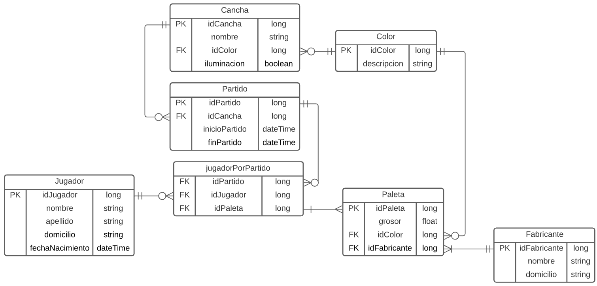

# DER cancha de paddle

***

***

1) Cancha y Paleta tendra una FK a la relacion Color, ya que podrian existir diferentes canchas o paletas que tengan el mismo color, lo que provocaria una repeticion de datos

2) Paleta tendra una FK a la relacion Fabricante, ya que podrian existir diferentes paletas del mismo fabricante, lo que provocaria una repeticion de datos  

3) Un partido tiene una FK a la relacion cancha, ya que podrian existir distintos partidos en distintas fechas en una misma cancha, lo que provocaria una repeticion de datos

4) Un partido tiene un atributo llamado organizador que es una FK a la relacion jugador, ya que puede haber distintos partidos con un mismo organizdor, lo que provocaria una repeticion de datos

5) Como la relacion entre los jugadores y los partidos es de mucho a muchos, ya que un jugador puede estar en muchos partidos, y un partido puede teenr muchos jugadores, debido a eso crea la tabla intermedia jugadorPorPartido con una PK compuesta por la FK de idPartido y la FK de idJugador, ademas agrego una FK a la relacion Paleta, la cual es la paleta asignada a un jugador en un partido especifico

